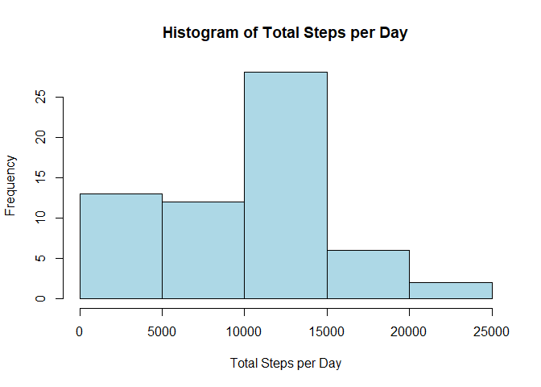
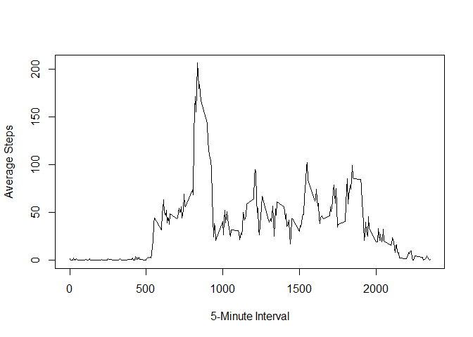
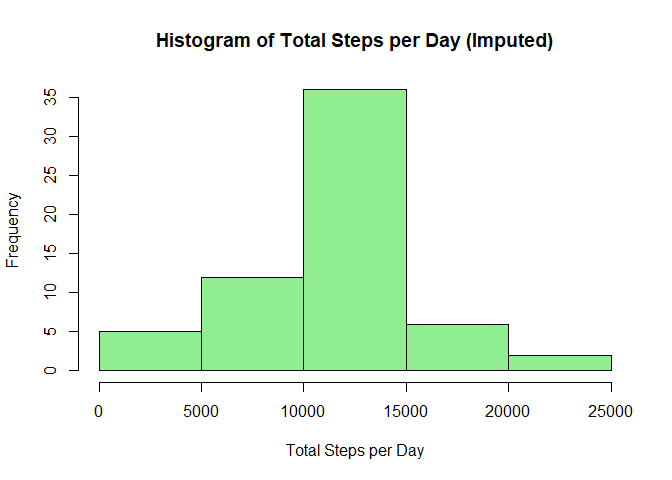
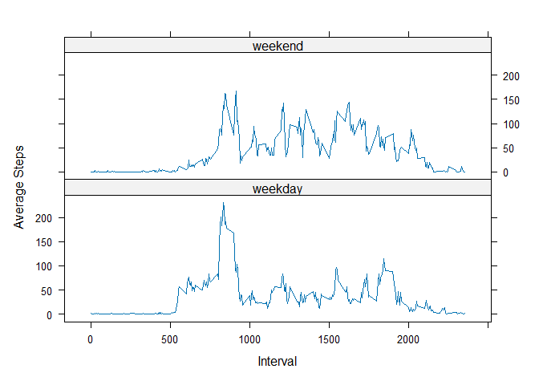

``` r
library(dplyr)
```

```
## 
## Attaching package: 'dplyr'
```

```
## The following objects are masked from 'package:stats':
## 
##     filter, lag
```

```
## The following objects are masked from 'package:base':
## 
##     intersect, setdiff, setequal, union
```

``` r
library(lattice)
```

# Loading and Preprocessing the Data

The dataset contains the number of steps taken in 5-minute intervals across two months (October and November 2012).  
The dataset is loaded and the date column is converted into Date format.


``` r
data <- read.csv("activity.csv")
data$date <- as.Date(data$date)
str(data)
```

```
## 'data.frame':	17568 obs. of  3 variables:
##  $ steps   : int  NA NA NA NA NA NA NA NA NA NA ...
##  $ date    : Date, format: "2012-10-01" "2012-10-01" ...
##  $ interval: int  0 5 10 15 20 25 30 35 40 45 ...
```

The dataset contains 17,568 observations with three variables:
- `steps`
- `date`
- `interval`

---

# What is the Mean Total Number of Steps Taken Per Day?

For this part, missing values are ignored.

Calculating the total number of steps taken each day.


``` r
steps_per_day <- data %>%
  group_by(date) %>%
  summarise(total_steps = sum(steps, na.rm = TRUE),
            .groups = "drop")
```

## Histogram of Total Steps Per Day


``` r
hist(steps_per_day$total_steps,
     main="Histogram of Total Steps per Day",
     xlab="Total Steps per Day",
     col="lightblue")
```

<!-- -->

The histogram shows the distribution of total daily steps.  
A right-skewed shape indicates the presence of highly active days.

## Mean and Median Total Steps Per Day


``` r
mean_steps <- mean(steps_per_day$total_steps)
median_steps <- median(steps_per_day$total_steps)

mean_steps
```

```
## [1] 9354.23
```

``` r
median_steps
```

```
## [1] 10395
```

The mean represents the average total steps per day, while the median represents the central value of the distribution.  
A difference between the two suggests skewness.

---

# What is the Average Daily Activity Pattern?

Examining the average number of steps taken for each 5-minute interval across all days.


``` r
interval_avg <- data %>%
  group_by(interval) %>%
  summarise(avg_steps = mean(steps, na.rm = TRUE),
            .groups = "drop")
```

## Time Series Plot


``` r
plot(interval_avg$interval,
     interval_avg$avg_steps,
     type="l",
     xlab="5-Minute Interval",
     ylab="Average Steps")
```

<!-- -->

The plot illustrates how activity levels change throughout the day.  
Peaks correspond to intervals with higher movement levels.

## Interval with Maximum Average Steps


``` r
interval_avg[which.max(interval_avg$avg_steps), ]
```

```
## # A tibble: 1 × 2
##   interval avg_steps
##      <int>     <dbl>
## 1      835      206.
```

This identifies the 5-minute interval with the highest average number of steps.

---

# Imputing Missing Values

Missing values may introduce bias into summary statistics.

Calculating the total number of missing observations.


``` r
sum(is.na(data$steps))
```

```
## [1] 2304
```

## Imputation Strategy

Missing values are replaced using the mean number of steps for the corresponding 5-minute interval.  
This preserves the general activity pattern across the day.


``` r
data_filled <- data

for(i in 1:nrow(data_filled)){
  if(is.na(data_filled$steps[i])){
    interval_value <- data_filled$interval[i]
    replacement <- interval_avg$avg_steps[
      interval_avg$interval == interval_value
    ]
    data_filled$steps[i] <- replacement
  }
}
```

## Recalculating Total Steps Per Day


``` r
steps_per_day_filled <- data_filled %>%
  group_by(date) %>%
  summarise(total_steps = sum(steps),
            .groups = "drop")
```

## Histogram After Imputation


``` r
hist(steps_per_day_filled$total_steps,
     main="Histogram of Total Steps per Day (Imputed)",
     xlab="Total Steps per Day",
     col="lightgreen")
```

<!-- -->

## Mean and Median After Imputation


``` r
mean(steps_per_day_filled$total_steps)
```

```
## [1] 10766.19
```

``` r
median(steps_per_day_filled$total_steps)
```

```
## [1] 10766.19
```

After imputation, changes in the mean and median indicate the impact of replacing missing values with interval averages.

---

# Are There Differences Between Weekdays and Weekends?

Classifying each observation as either weekday or weekend.


``` r
data_filled$day_type <- ifelse(
  weekdays(data_filled$date) %in% c("Saturday", "Sunday"),
  "weekend",
  "weekday"
)

data_filled$day_type <- as.factor(data_filled$day_type)
```

Calculating average steps per interval separately for weekdays and weekends.


``` r
interval_daytype <- data_filled %>%
  group_by(interval, day_type) %>%
  summarise(avg_steps = mean(steps),
            .groups = "drop")
```

## Panel Plot Comparison


``` r
xyplot(avg_steps ~ interval | day_type,
       data=interval_daytype,
       type="l",
       layout=c(1,2),
       xlab="Interval",
       ylab="Average Steps")
```

<!-- -->

The panel plot enables comparison of activity patterns between weekdays and weekends.  
Differences in peak intervals or intensity may reflect variations in daily routines.

---

# Conclusion

This analysis examined:

- Distribution of total daily steps  
- Average activity patterns across intervals  
- Impact of missing value imputation  
- Differences between weekday and weekend behavior  

The results highlight how temporal structure and missing data handling influence summary statistics and interpretation.
